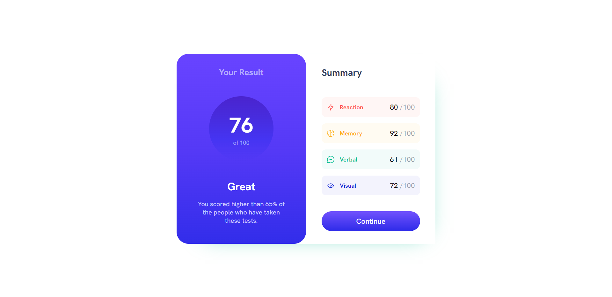

# Frontend Mentor - Results summary component solution

This is a solution to the [Results summary component challenge on Frontend Mentor](https://www.frontendmentor.io/challenges/results-summary-component-CE_K6s0maV). Frontend Mentor challenges help you improve your coding skills by building realistic projects. 

## Table of contents

- [Frontend Mentor - Results summary component solution](#frontend-mentor---results-summary-component-solution)
  - [Table of contents](#table-of-contents)
    - [The challenge](#the-challenge)
    - [Screenshot](#screenshot)
    - [Links](#links)
    - [Built with](#built-with)
    - [What I learned](#what-i-learned)
  - [Author](#author)

### The challenge

Users should be able to:

- View the optimal layout for the interface depending on their device's screen size
- See hover and focus states for all interactive elements on the page

### Screenshot

Here is a small desktop preview of my solution 

### Links

- Solution URL: [Add solution URL here](https://codie123.github.io/result-summary-component/)
- Live Site URL: [Add live site URL here](https://github.com/Codie123/result-summary-component)

### Built with

- Semantic HTML5 markup
- CSS custom properties
- Flexbox
- CSS Grid
- js
- Mobile-first workflow

### What I learned

This project helps me to learn about fetch in js 

## Author

- Website - [Nazeem](https://codie123.github.io/portfolio_Codie/)
- Frontend Mentor - [@Codie123](https://www.frontendmentor.io/profile/Codie123)

